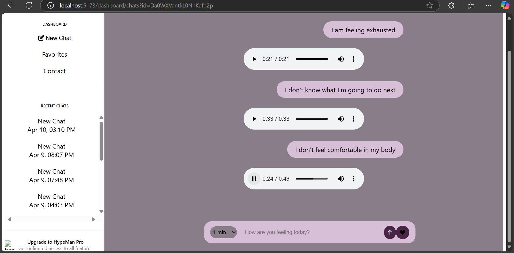
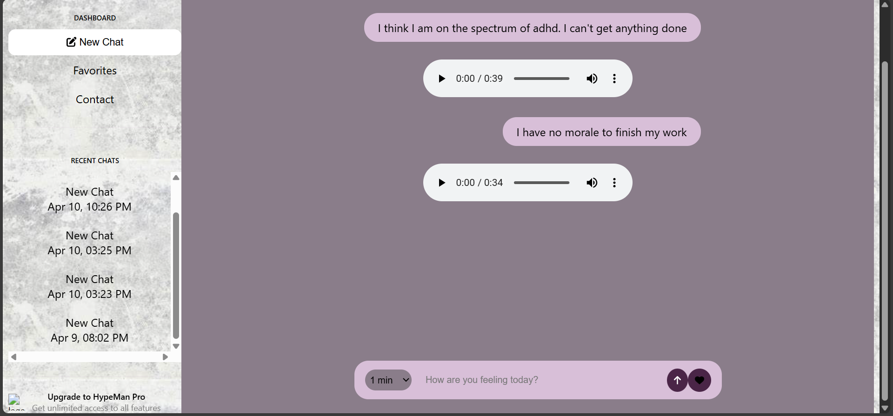

  

  

HypeMan is a website for generating AI-powered speech content to motivate its users through tough times, like experiencing imposter syndrome, anxiety, or any other issue that hinders them from using their full potential. Everyone needs encouragement at some points in their life, and they may or may not get it. HypeMan has your back with personalized motivations that will help you get through those tough times.
 

Check out HypeMan [here](https://hypeman-7678f.web.app/)🔥!

## Overview

Hypeman API serves as the backend for the Hypeman platform, providing endpoints for AI-generated text content and text-to-speech conversion using Groq's LLM and TTS services. The application also integrates with Firebase Firestore to manage user chat history.

## Features

- 🤖 AI-powered text generation using Groq's LLaMa 3.3 70B model
- 🔊 Text-to-speech conversion with PlayAI TTS
- 🔥 Firebase integration for user data storage and retrieval
- 🔒 Environment-based configuration for secure deployment

## Technologies

- Express.js
- Firebase Admin SDK
- Groq API (LLM & TTS)
- CORS support
- Dotenv for environment management
- React.js

## API Endpoints

### Generate Text and Speech
```
POST /api/generate
```
Generates both text content and corresponding speech audio.

**Request Body:**
```json
{
  "prompt": "User input prompt",
  "systemPrompt": "System instructions",
  "duration": 1 
}
```

**Response:**
```json
{
  "text": "Generated text content",
  "audio": "Base64 encoded WAV audio"
}
```

### Create New Chat
```
POST /api/chats
```
Creates a new chat session for a user.

**Request Body:**
```json
{
  "userId": "user_unique_id",
  "title": "Chat Title" 
}
```

### Get User Chat History
```
GET /api/chats/:userId
```
Retrieves all chat sessions for a specific user.

## Installation

1. Clone the repository
```bash
git clone https://github.com/yourusername/hypeman.git
cd hypeman
```

2. Install dependencies
```bash
npm install
```

3. Set up environment variables
Create a `.env` file in the root directory with:
```
PORT=3000
CLIENT_URL=http://localhost:5173
GROQ_API_KEY=your_groq_api_key
```

4. Add Firebase service account key
Place your `service_account_key.json` file in the root directory.

## Running the Application

Development mode:
```bash
npm run dev
```

Production mode:
```bash
npm start
```

## Troubleshooting

If you encounter a "port in use" error:
```
Error: listen EADDRINUSE: address already in use :::3000
```

Either:
- Change the port in the `.env` file
- Find and terminate the process using port 3000:
  ```bash
  # Windows
  netstat -ano | findstr :3000
  taskkill /PID <PID> /F
  
  # macOS/Linux
  lsof -i :3000
  kill -9 <PID>
  ```

## Related projects

- [Calm](https://www.calm.com/)
- [HeadSpace](https://www.headspace.com/)

## License

[MIT LICENSE](https://github.com/N-benitha/Hypeman2/blob/7ab79c8ef6fd1ab4d8f19649ecf0286f7bd7077a/LICENSE)

## Contact

For support or inquiries, do not hesitate to contact me here.
[LinkeIn](https://www.linkedin.com/in/ngunga-benitha-26b43921b?utm_source=share&utm_campaign=share_via&utm_content=profile&utm_medium=android_app)
